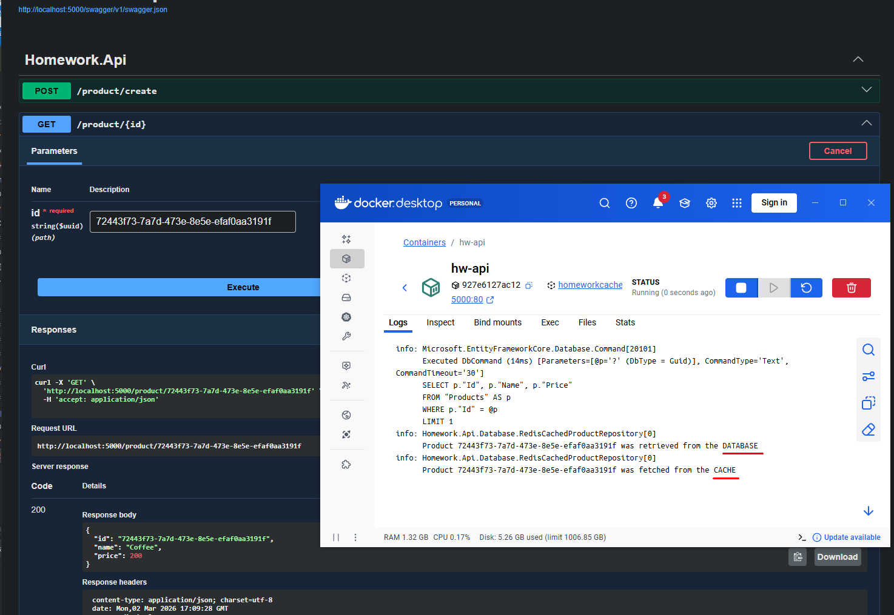
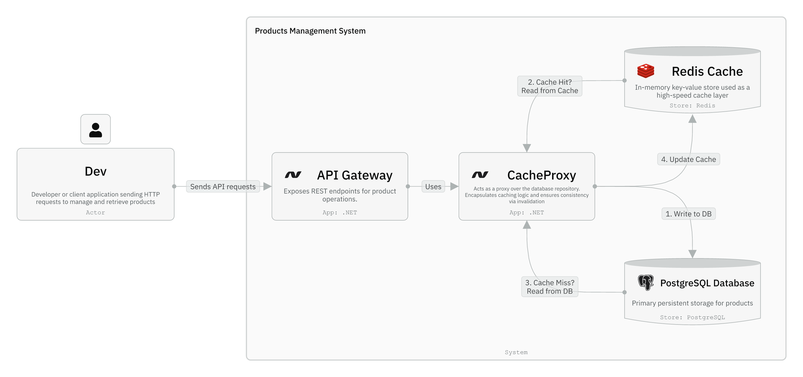
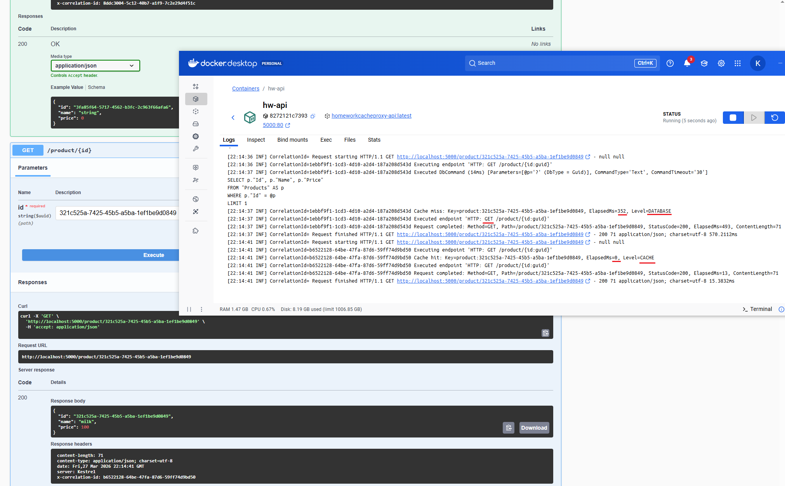

## Homework.CacheProxy

Проект демонстрирует реализацию паттерна Cache-Aside (Lazy Loading)


### Что сделано
- Паттерн Cache-Aside - при чтении проверяем Redis, при записи инвалидируем кеш
- PostgreSQL - основное хранилище 
- Redis - кэширующий слой
- Docker Compose - запуск всех сервисов
- CRUD API

### Как работает
1. Проверяет Redis по ключу `prefix:{id}`
2. Если данные есть, то возвращает их из кэша
3. Если нет, то идет в PostgreSQL, возвращает результат и прогревает кэш с TTL


*Демонстрация Cache-Aside: первый запрос идет в БД, второй - из Redis*

### Архитектура



### Некоторые моменты реализации

#### 1. Декоратор для репозитория
`RedisCachedProductRepository` оборачивает `EfProductRepository` и добавляет кэширование - не изменяя логику работы с БД.

#### 2. Инвалидация кэша
При добавлении/обновлении/удалении - кэш сбрасывается (принцип cache-aside):
```csharp
private async Task InvalidateAsync(Guid id)
{
    var key = $"{_settings.KeyPrefix}:{id}";
    await _cache.KeyDeleteAsync(key);
}
```

#### 3. Настройки TTL и префикса
Вынесены в `appsettings.json`:
```json
"ProductCacheSettings": {
  "TTL": 300,
  "KeyPrefix": "product"
}
```

#### 4. Структурированное логирование

##### StructuredLoggingMiddleware
Middleware для сквозного отслеживания HTTP-запросов с метриками производительности:

**Функциональность:**
- Генерация уникального `X-Correlation-ID` для каждого запроса
- Измерение времени выполнения запроса (Stopwatch)
- Перехват исключений с полным стеком вызовов
- Автоматическое добавление Correlation ID в заголовки ответа


*Демонстрация структурированного логирования: Correlation ID, время выполнения, попадания и промахи кэша*

**Пример логов:**
```
[14:25:33 INF] Request started: CorrelationId=a1b2c3d4-e5f6-47g8-h9i0-j1k2l3m4n5o6, 
               Method=GET, Path=/product/123
[14:25:33 INF] Request completed: CorrelationId=a1b2c3d4-e5f6-47g8-h9i0-j1k2l3m4n5o6, 
               Method=GET, Path=/product/123, StatusCode=200, ElapsedMs=12, ContentLength=145
```

##### ICacheOperationLogger
Специализированный логгер для операций кэша с типобезопасностью:

**Интерфейс:**
```csharp
public interface ICacheOperationLogger
{
    void LogCacheHit(string key, long elapsedMs);      // Попадание из Redis
    void LogCacheMiss(string key, long elapsedMs);     // Промах - запрос в БД
    void LogCacheInvalidation(string key, string operation);  // Инвалидация кэша
    void LogCacheError(string key, Exception ex);      // Ошибки операций
}
```

**Пример логов кэша:**
```
[14:25:33 INF] Cache hit: Key=product:123, ElapsedMs=2, Level=CACHE
[14:25:40 INF] Cache miss: Key=product:456, ElapsedMs=18, Level=DATABASE
[14:25:50 INF] Cache invalidated: Key=product:789, Operation=UPDATE
[14:26:00 WRN] Cache operation failed: Key=product:999, ExceptionType=RedisConnectionException
```

### API Endpoints

| Метод | URL | Описание |
|-------|-----|----------|
| POST | `/product/create` | Создать товар |
| GET | `/product/{id}` | Получить товар (с кэшем) |
| POST | `/product/update` | Обновить товар |
| POST | `/product/delete/{id}` | Удалить товар |

### Запуск проекта

```bash
docker-compose up -d
```

После запуска:
- API: http://localhost:5000
- Swagger: http://localhost:5000/swagger

### Просмотр логов

```bash
# Логи контейнера API
docker logs hw-api -f

# Или если запущено локально
dotnet run --project Homework.Api/Homework.Api.csproj
```

 
 
