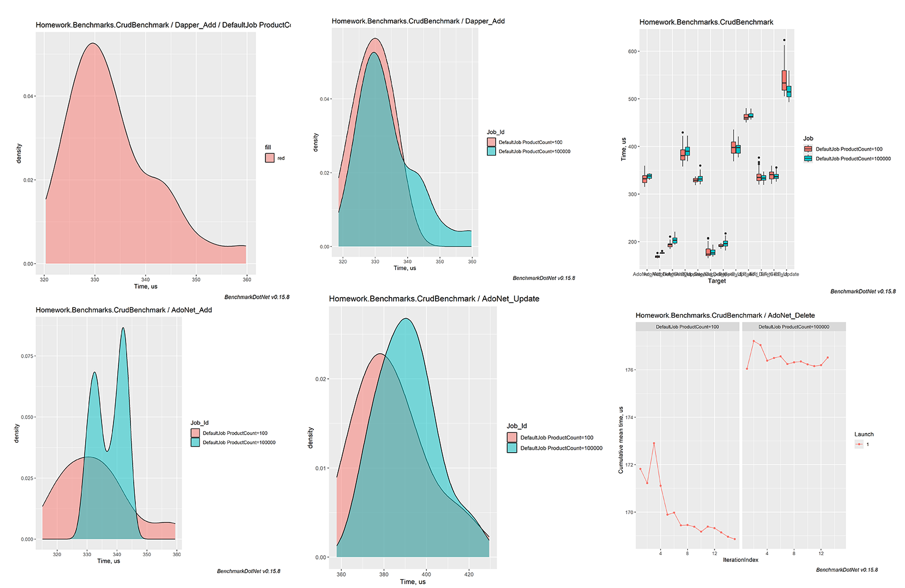

## Бенчмарки производительности ORM: EF Core, Dapper + ADO.NET

Сравнение базовой CRUD производительности популярных способов доступа к данным в .NET:
- Entity Framework Core (полноценный ORM)
- Dapper (микро-ORM)
- ADO.NET (прямая работа с драйвером БД)

Тестируются основные CRUD-операции: GET, ADD, UPDATE, DELETE.

### Конфигурация бенчмарков
- Target .NET версии: .NET 10 (LTS)
- Диагностики: [MemoryDiagnoser], [ThreadingDiagnoser]
- Группировка: [GroupBenchmarksBy(BenchmarkLogicalGroupRule.ByCategory)] и [CategoriesColumn] для разделения результатов по категориям операций
- Параметры: [Params(100, 100_000)] - количество записей в таблице Products
- База: PostgreSQL, временная БД создается под каждый запуск и удаляется в конце
- Экспорт графиков: [RPlotExporter]

### Пример результатов
```
// * Summary *

BenchmarkDotNet v0.15.8, Windows 10 (10.0.19045.6456/22H2/2022Update)
AMD Ryzen 5 5600H with Radeon Graphics 3.30GHz, 1 CPU, 12 logical and 6 physical cores
.NET SDK 10.0.103
[Host]     : .NET 10.0.3 (10.0.3, 10.0.326.7603), X64 RyuJIT x86-64-v3
DefaultJob : .NET 10.0.3 (10.0.3, 10.0.326.7603), X64 RyuJIT x86-64-v3


| Method         | Categories | ProductCount | Mean     | Error    | StdDev   | Median   | Ratio | RatioSD | Gen0   | Completed Work Items | Lock Contentions | Allocated | Alloc Ratio |
|--------------- |----------- |------------- |---------:|---------:|---------:|---------:|------:|--------:|-------:|---------------------:|-----------------:|----------:|------------:|
| EF_Add         | ADD        | 100          | 462.3 us |  8.68 us |  8.52 us | 460.2 us |  1.00 |    0.03 | 7.8125 |               1.9902 |           0.0039 |  64.26 KB |        1.00 |
| Dapper_Add     | ADD        | 100          | 329.2 us |  5.80 us |  5.42 us | 329.0 us |  0.71 |    0.02 | 0.4883 |               2.0000 |                - |   4.92 KB |        0.08 |
| AdoNet_Add     | ADD        | 100          | 332.6 us |  6.58 us | 11.34 us | 332.2 us |  0.72 |    0.03 | 0.4883 |               1.9956 |           0.0010 |   4.77 KB |        0.07 |
|                |            |              |          |          |          |          |       |         |        |                      |                  |           |             |
| EF_Add         | ADD        | 100000       | 465.1 us |  8.74 us |  6.82 us | 462.7 us |  1.00 |    0.02 | 7.8125 |               1.9941 |           0.0020 |  64.24 KB |        1.00 |
| Dapper_Add     | ADD        | 100000       | 333.6 us |  6.18 us |  9.06 us | 331.7 us |  0.72 |    0.02 | 0.4883 |               1.9961 |           0.0005 |   4.91 KB |        0.08 |
| AdoNet_Add     | ADD        | 100000       | 337.3 us |  5.70 us |  5.05 us | 338.1 us |  0.73 |    0.01 | 0.4883 |               1.9961 |           0.0024 |   4.78 KB |        0.07 |
|                |            |              |          |          |          |          |       |         |        |                      |                  |           |             |
| EF_Delete      | DELETE     | 100          | 337.9 us |  6.70 us | 12.74 us | 334.9 us |  1.00 |    0.05 | 6.8359 |               1.9805 |                - |  58.65 KB |        1.00 |
| Dapper_Delete  | DELETE     | 100          | 178.1 us |  3.55 us | 10.34 us | 173.7 us |  0.53 |    0.04 | 0.2441 |               1.9885 |           0.0005 |   2.72 KB |        0.05 |
| AdoNet_Delete  | DELETE     | 100          | 168.9 us |  3.15 us |  2.94 us | 168.6 us |  0.50 |    0.02 | 0.2441 |               1.9978 |           0.0015 |   2.49 KB |        0.04 |
|                |            |              |          |          |          |          |       |         |        |                      |                  |           |             |
| EF_Delete      | DELETE     | 100000       | 333.8 us |  6.49 us |  7.21 us | 333.4 us |  1.00 |    0.03 | 6.8359 |               1.9932 |           0.0020 |  58.53 KB |        1.00 |
| Dapper_Delete  | DELETE     | 100000       | 178.1 us |  3.51 us |  7.02 us | 176.4 us |  0.53 |    0.02 | 0.2441 |               1.9929 |           0.0007 |   2.72 KB |        0.05 |
| AdoNet_Delete  | DELETE     | 100000       | 176.5 us |  1.95 us |  1.63 us | 176.6 us |  0.53 |    0.01 | 0.2441 |               1.9873 |           0.0010 |   2.48 KB |        0.04 |
|                |            |              |          |          |          |          |       |         |        |                      |                  |           |             |
| EF_GetById     | GET        | 100          | 340.2 us |  6.65 us |  9.74 us | 340.9 us |  1.00 |    0.04 | 6.8359 |               1.9863 |           0.0020 |  56.91 KB |        1.00 |
| Dapper_GetById | GET        | 100          | 191.9 us |  3.66 us |  3.42 us | 191.1 us |  0.56 |    0.02 |      - |               1.9937 |           0.0005 |   3.62 KB |        0.06 |
| AdoNet_GetById | GET        | 100          | 193.8 us |  3.45 us |  5.76 us | 193.9 us |  0.57 |    0.02 |      - |               1.9990 |           0.0020 |   3.05 KB |        0.05 |
|                |            |              |          |          |          |          |       |         |        |                      |                  |           |             |
| EF_GetById     | GET        | 100000       | 337.8 us |  5.69 us |  7.39 us | 336.6 us |  1.00 |    0.03 | 6.8359 |               1.9863 |                - |  56.88 KB |        1.00 |
| Dapper_GetById | GET        | 100000       | 196.7 us |  3.88 us |  8.68 us | 195.9 us |  0.58 |    0.03 | 0.2441 |               1.9907 |           0.0010 |   3.55 KB |        0.06 |
| AdoNet_GetById | GET        | 100000       | 203.4 us |  4.03 us |  7.47 us | 203.0 us |  0.60 |    0.03 | 0.2441 |               1.9915 |           0.0002 |   3.03 KB |        0.05 |
|                |            |              |          |          |          |          |       |         |        |                      |                  |           |             |
| EF_Update      | UPDATE     | 100          | 542.0 us | 10.73 us | 29.01 us | 533.4 us |  1.00 |    0.07 | 7.8125 |               1.9844 |           0.0020 |  65.36 KB |        1.00 |
| Dapper_Update  | UPDATE     | 100          | 398.1 us |  7.87 us | 16.94 us | 397.8 us |  0.74 |    0.05 |      - |               1.9863 |           0.0010 |   5.89 KB |        0.09 |
| AdoNet_Update  | UPDATE     | 100          | 384.1 us |  7.66 us | 17.12 us | 380.7 us |  0.71 |    0.05 |      - |               1.9990 |                - |   5.84 KB |        0.09 |
|                |            |              |          |          |          |          |       |         |        |                      |                  |           |             |
| EF_Update      | UPDATE     | 100000       | 516.8 us | 10.14 us | 17.22 us | 514.6 us |  1.00 |    0.05 | 7.8125 |               1.9922 |           0.0020 |  65.36 KB |        1.00 |
| Dapper_Update  | UPDATE     | 100000       | 396.6 us |  7.90 us | 11.58 us | 397.6 us |  0.77 |    0.03 | 0.4883 |               1.9922 |           0.0010 |   5.95 KB |        0.09 |
| AdoNet_Update  | UPDATE     | 100000       | 390.8 us |  7.79 us | 13.43 us | 389.9 us |  0.76 |    0.04 | 0.4883 |               1.9951 |           0.0005 |   5.81 KB |        0.09 |
```

> БД создается временная, после бенчмарков удаляется.

> Тестовые данные генерируются через Bogus (категории + продукты)

