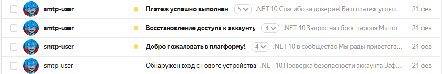
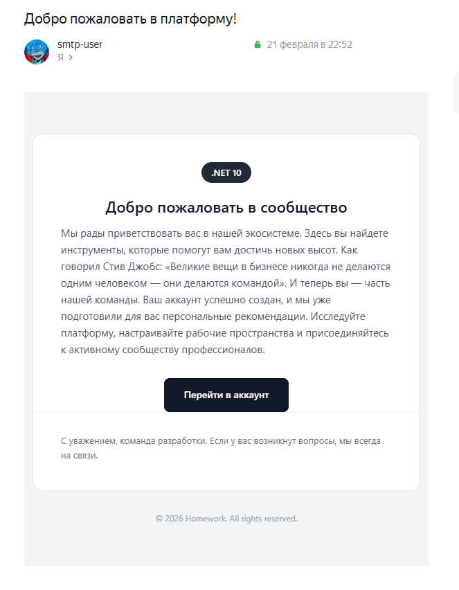
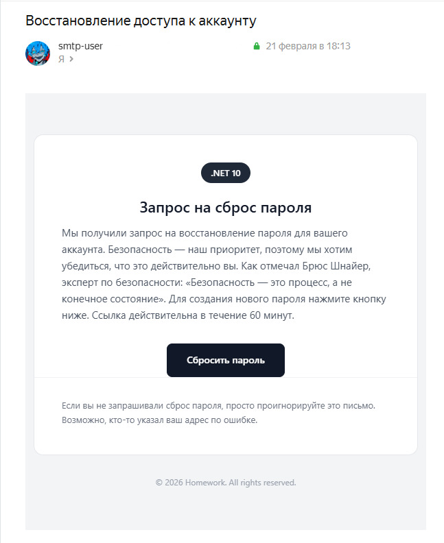
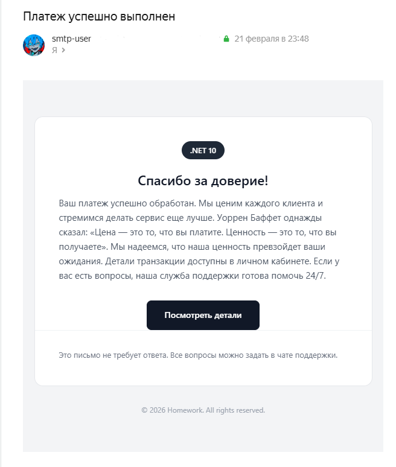
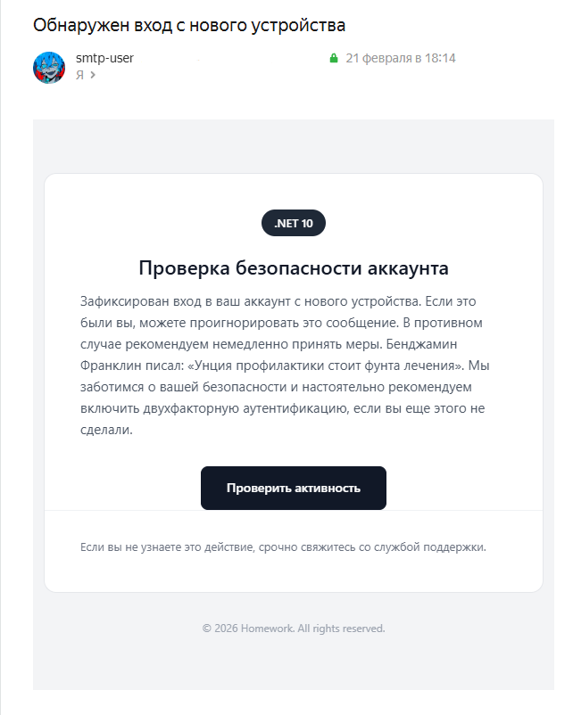

## Homework.Notifications сервис

**Homework.Notifications** - решение для отправки email-уведомлений с поддержкой HTML-шаблонов, массовой рассылки и отложенной доставки.

Сервис использует [SmptClient](https://learn.microsoft.com/ru-ru/dotnet/api/system.net.mail.smtpclient?view=net-10.0) [obsolete, но для своих задач справился] и [HtmlRenderer](https://learn.microsoft.com/en-us/dotnet/api/microsoft.aspnetcore.components.web.htmlrenderer?view=aspnetcore-10.0) из части Blazor, который рендерит письма через Razor Components (см. [NotificationMessage.razor](templates/NotificationMessage.razor)).


_Пример того, как письма выглядят в почтовом клиенте_

---

**Что требовалось:**
1. Отправка email с поддержкой HTML-шаблонов
2. Возможность массовой отправки
3. Задержка между отправками
4. Упаковка в NuGet (опционально)

**Что сделано:**
1. Полноценный провайдер с [`IEmailSender`](Services/Abstractions/IEmailSender.cs), поддерживающий одиночные, массовые и отложенные отправки
2. HTML-шаблоны на базе Razor Components с параметризацией
3. Конфигурация через [`appsettings.json`](appsettings.json) с поддержкой множества шаблонов
4. Защита чувствительных данных - места для паролей оставлены пустыми. Предоставлен только контракт.

---

### Примеры шаблонов
<div align="center">
  <table>
    <tr>
      <td width="500"></td>
      <td width="500"></td>
    </tr>
    <tr>
      <td align="center" style="padding-bottom: 40px; font-size: 1.1em;"><strong> Приветственное письмо</strong><br><span style="color: #666;">после регистрации</span></td>
      <td align="center" style="padding-bottom: 40px; font-size: 1.1em;"><strong> Сброс пароля</strong><br><span style="color: #666;">восстановление доступа</span></td>
    </tr>
    <tr>
      <td width="500"></td>
      <td width="500"></td>
    </tr>
    <tr>
      <td align="center" style="font-size: 1.1em;"><strong> Подтверждение покупки</strong><br><span style="color: #666;">детали заказа</span></td>
      <td align="center" style="font-size: 1.1em;"><strong> Оповещение безопасности</strong><br><span style="color: #666;">вход с нового устройства</span></td>
    </tr>
  </table>
</div>

<br clear="all"/>

---

### Конфигурация

Минимальная настройка через `appsettings.json`.
```json
{
  "EmailSettings": {                        // Оставить пустым, заполнить через User Secrets
    "SmtpServer": "smtp.yandex.ru",         // SMTP-сервер
    "SmtpPort": 25,                         // Порт
    "SmtpUser": "your-email@yandex.ru",     // Логин
    "SmtpPassword": "",                     // Пароль
    "SmtpReply": "noreply@yourdomain.com",  // Обратный адрес
    "EnableSsl": true
  },
  
  "NotificationTemplates": {
    "Templates": {
      "Welcome": {
        "Subject": "Добро пожаловать!",
        "DefaultTitle": "Рады видеть вас",
        "DefaultMessage": "Спасибо, что выбрали нас...",
        "DefaultFooter": "С уважением, команда",
        "ShowButton": true,
        "ButtonDefaultText": "Начать работу",
        "ButtonDefaultUrl": "https://yourdomain.com"
      }
    }
  }
}
```

